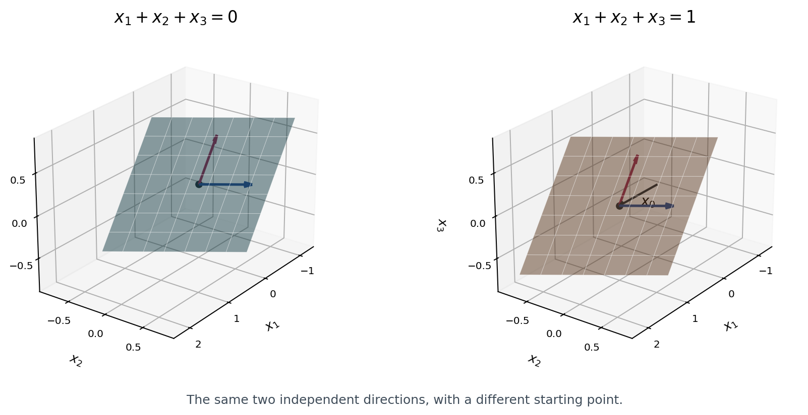

*These notes were drafted with the help of ChatGPT from my handwritten notes and the discussion used to prepare the recitation.*

## 1. A little about mathematics

What is mathematics? It is hard to give a short definition, so let us look at a few of its subjects and the kinds of questions they ask.

**Number theory** studies integers, primes, and equations with integer solutions. Fermat's Last Theorem is a familiar example: $x^n+y^n=z^n$ has no positive integer solutions when $n>2$ is an integer. The question is easy to state, but the proof uses a great deal of modern mathematics.

For **algebra**, polynomial equations are a good place to start. The Fundamental Theorem of Algebra says that a degree-$n$ polynomial with complex coefficients has $n$ roots, counted with multiplicity. Finding those roots is another matter. There is no general formula by radicals for quintic equations, although some particular quintics can be solved that way. Questions about equations eventually lead to structures such as groups, rings, and fields.

**Analysis** starts from calculus, but there is much more to it than computing derivatives and integrals. The Newton–Leibniz formula says that $\int_a^b f(x)\,dx=F(b)-F(a)$ when $f$ is continuous and $F'=f$. It relates a rate of change to the accumulated change. Analysis also asks what happens when we pass to a limit. For example, $f_n(x)=x^n$ is continuous on $[0,1]$ for every $n$, but its pointwise limit is

$$
f(x)=\begin{cases}0,&0\le x<1,\\1,&x=1,\end{cases}
$$

which is discontinuous. Each fixed point below $1$ eventually has a small value, but points sufficiently close to $1$ still have values close to $1$. This is why pointwise convergence is different from uniform convergence. A uniform limit of continuous functions is continuous. Similar questions arise when we construct approximate solutions to differential equations: does the limit exist, and does it solve the equation?

**Topology** studies properties that survive a homeomorphism, or, informally, a change of shape without tearing or gluing. For a convex polyhedron, $V-E+F=2$. A tetrahedron gives $4-6+4=2$, while a cube gives $8-12+6=2$. This leads to the Euler characteristic, which is $2$ for a sphere and $0$ for a torus. Knot theory asks related questions about whether one loop can be deformed into another without cutting it or passing it through itself.

**Geometry** studies space, distance, angles, and curvature. A triangle on a sphere can have three right angles: take the North Pole and two points on the equator whose longitudes differ by $90$ degrees, and join them by shorter great-circle arcs. The angle sum is $270$ degrees.

This also explains why an airplane's route can look curved on a flat map. If we approximate Earth by a sphere, the shortest surface route between two non-antipodal points follows the shorter great-circle arc. Except for the equator, latitude circles are not great circles. Beijing and New York are both near latitude $40$ degrees north, but following that latitude is not the shortest route between them. Flattening the globe onto a map changes the appearance of the route and distorts distances. Of course, actual flights also depend on winds and airspace restrictions.

**Probability** studies random phenomena. The law of large numbers says that, for independent tosses of a fair coin, the proportion of heads approaches $1/2$ in probability. It does not say that a run of heads makes tails more likely on the next toss.

**Combinatorics** studies counting, arrangements, and discrete structures. Here is a nice example: among six people, there are three who pairwise know each other or three who pairwise do not know each other. Assume acquaintance is mutual. Pick one person, $A$. Among the other five, at least three all know $A$ or all do not know $A$. In the first case, if any two of those three know each other, they form an acquainted triple with $A$. Otherwise those three are pairwise unacquainted. The other case works the same way, with the roles reversed.

So what is **linear algebra**? A useful starting point is to think of algebra as the study of polynomial equations, and “linear” as degree one. We begin with equations such as $ax+by=c$, where $a,b,c$ are fixed numbers and the unknowns appear only to the first power. There are no products of unknowns: $xy$ has total degree two, even though each variable has exponent one. Linear algebra starts with systems of these equations and develops the ideas of vectors, matrices, and linear maps.

Matrices will help us organize linear equations. Later they will describe transformations, including the rotations and projections used in computer graphics. For now, let us see how solving a system leads us to questions about its whole solution set.

## 2. Solving a system

Consider

$$
\begin{cases}
x+y+z=6,\\
2x+3y+z=11,\\
x+2y+3z=14.
\end{cases}
$$

Write down its augmented matrix. Subtract twice the first row from the second, and subtract the first row from the third:

$$
\left[\begin{array}{ccc|c}
1&1&1&6\\2&3&1&11\\1&2&3&14
\end{array}\right]
\longrightarrow
\left[\begin{array}{ccc|c}
1&1&1&6\\0&1&-1&-1\\0&1&2&8
\end{array}\right].
$$

Now use $R_3\leftarrow R_3-R_2$:

$$
\left[\begin{array}{ccc|c}
1&1&1&6\\0&1&-1&-1\\0&0&3&9
\end{array}\right].
$$

Reading from the bottom gives $z=3$, then $y=2$, then $x=1$. There is no choice left, so the solution is unique.

Why can we change the equations this way? Each row operation can be undone. For instance, the inverse of $R_i\leftarrow R_i+cR_j$ is $R_i\leftarrow R_i-cR_j$, where $i\ne j$. Swapping rows and multiplying a row by a nonzero number are also reversible. The new system therefore has exactly the same solutions.

Compare this with replacing both equations $x=1$, $y=2$ by copies of $x+y=3$. The new equation is true for the original solution, but we have lost information. Keeping $x=1$ and replacing only the second equation by $x+y=3$ is fine.

In our example, elimination determined every variable. In another system, some choices may remain. To understand those choices, it helps to compare two solutions of the same system.

## 3. Homogeneous and nonhomogeneous systems

Write a linear system as $Ax=b$. If $x$ and $x_0$ both solve it, their difference satisfies $A(x-x_0)=0$. This brings in the associated homogeneous system $Av=0$, with the same matrix $A$.

Suppose we already know one solution $x_0$ of $Ax=b$. If $Av=0$, then $A(x_0+v)=b$, so $x_0+v$ is another solution. Conversely, as we just observed, every solution $x$ differs from $x_0$ by a homogeneous solution. Thus every solution is a particular solution plus a homogeneous solution. If we write $N(A)=\{v:Av=0\}$, the nullspace of $A$, this becomes

$$
\{x:Ax=b\}=x_0+N(A).
$$

This formula assumes that a particular solution exists. The homogeneous system always has the zero solution, but $Ax=b$ might have no solution.

For example, take $x_1+x_2+x_3=1$. Set $x_2=s$ and $x_3=t$. Then $x_1=1-s-t$, and

$$
\begin{pmatrix}x_1\\x_2\\x_3\end{pmatrix}
=\begin{pmatrix}1-s-t\\s\\t\end{pmatrix}
=\begin{pmatrix}1\\0\\0\end{pmatrix}
+s\begin{pmatrix}-1\\1\\0\end{pmatrix}
+t\begin{pmatrix}-1\\0\\1\end{pmatrix}.
$$

We get the last expression just by collecting the constant terms and the coefficients of $s,t$. Setting both parameters to zero gives the particular solution $(1,0,0)^{\mathsf T}$. Increasing $s$ by one changes the solution by $(-1,1,0)^{\mathsf T}$. Increasing $t$ by one changes it by $(-1,0,1)^{\mathsf T}$. Both changes leave the sum of the coordinates unchanged.

The two direction vectors are independent: in a linear combination equal to zero, the second and third coordinates force both coefficients to vanish. This is why we have two degrees of freedom.

The picture is a translation. The homogeneous plane passes through the origin, and adding $(1,0,0)^{\mathsf T}$ moves it to $x_1+x_2+x_3=1$. A different particular solution gives the same plane. Indeed, the difference between any two particular solutions is already a homogeneous solution.

There is a small distinction worth keeping in mind. If $Au=Av=0$, every linear combination $\alpha u+\beta v$ is again a homogeneous solution. If $Au=Av=b\ne0$, then

$$
A(\alpha u+\beta v)=(\alpha+\beta)b,
$$

so we need $\alpha+\beta=1$. The midpoint of two solutions is still a solution, while their sum generally is not. The homogeneous solution set is a linear subspace. A nonempty solution set of $Ax=b$ is a translate of one, called an affine subspace.

The plane example has two free directions, whereas the first system had none. The next exercise lets us see both possibilities, and also inconsistency, by changing just one parameter.

## 4. A parameter changes the answer

In Exercise 1.14(2), we want to solve

$$
\begin{cases}
\lambda x_1+x_2+x_3=1,\\
x_1+\lambda x_2+x_3=1,\\
x_1+x_2+\lambda x_3=1.
\end{cases}
$$

Start by swapping the first two rows. This lets us use $1$ as the first pivot without discussing whether $\lambda$ is zero:

$$
\left[\begin{array}{ccc|c}
\lambda&1&1&1\\1&\lambda&1&1\\1&1&\lambda&1
\end{array}\right]
\longrightarrow
\left[\begin{array}{ccc|c}
1&\lambda&1&1\\\lambda&1&1&1\\1&1&\lambda&1
\end{array}\right].
$$

Apply $R_2\leftarrow R_2-\lambda R_1$ and $R_3\leftarrow R_3-R_1$:

$$
\left[\begin{array}{ccc|c}
1&\lambda&1&1\\
0&1-\lambda^2&1-\lambda&1-\lambda\\
0&1-\lambda&\lambda-1&0
\end{array}\right].
$$

Swap rows $2,3$, then use $R_3\leftarrow R_3-(1+\lambda)R_2$:

$$
\left[\begin{array}{ccc|c}
1&\lambda&1&1\\
0&1-\lambda&\lambda-1&0\\
0&0&(1-\lambda)(\lambda+2)&1-\lambda
\end{array}\right].
$$

We have not divided by anything involving $\lambda$, so these steps work for every value of the parameter.

When $\lambda=1$, the system reduces to $x_1+x_2+x_3=1$. We have already found all its solutions:

$$
x=\begin{pmatrix}1\\0\\0\end{pmatrix}
+s\begin{pmatrix}-1\\1\\0\end{pmatrix}
+t\begin{pmatrix}-1\\0\\1\end{pmatrix},\qquad s,t\in\mathbb R.
$$

When $\lambda\ne1$, we can divide rows $2,3$ by $1-\lambda$:

$$
\left[\begin{array}{ccc|c}
1&\lambda&1&1\\0&1&-1&0\\0&0&\lambda+2&1
\end{array}\right].
$$

If $\lambda=-2$, the last row says $0=1$, so there is no solution. For all other values in this case, back-substitution gives $x_1=x_2=x_3=1/(\lambda+2)$, the unique solution.

There is also a short way to see this. Subtract consecutive equations:

$$
(\lambda-1)(x_1-x_2)=0,\qquad
(\lambda-1)(x_2-x_3)=0.
$$

If $\lambda\ne1$, all three variables must equal some $t$, and the original equations give $(\lambda+2)t=1$. If $\lambda=1$, all three original equations are the same. Notice the difference between the exceptional values: at $1$ we lose constraints, while at $-2$ the equations contradict one another.

## 5. Four points on a circle (optional)

We can also use a linear system to find a geometric object. In Exercise 1.15(2), four distinct points $P_i=(x_i,y_i)$ are given, and we ask whether one circle can pass through all four. The unknowns will be the coefficients of the circle equation.

Start from $(x-a)^2+(y-b)^2=r^2$. After expansion, a circle has the form

$$
x^2+y^2+Dx+Ey+F=0,
$$

where $D=-2a$, $E=-2b$, and $F=a^2+b^2-r^2$. The point coordinates are known, and the coefficients $D,E,F$ are what we want to find. Substituting the four points gives

$$
x_iD+y_iE+F=-(x_i^2+y_i^2),\qquad i=1,2,3,4.
$$

These are four linear equations in three unknowns. In matrix form, they are $Mc=-q$, where

$$
M=\begin{pmatrix}
x_1&y_1&1\\x_2&y_2&1\\x_3&y_3&1\\x_4&y_4&1
\end{pmatrix},\qquad
c=\begin{pmatrix}D\\E\\F\end{pmatrix},\qquad
q=\begin{pmatrix}
x_1^2+y_1^2\\x_2^2+y_2^2\\x_3^2+y_3^2\\x_4^2+y_4^2
\end{pmatrix}.
$$

If this system has a solution, does it really give a circle? Complete the square:

$$
\left(x+\frac D2\right)^2+\left(y+\frac E2\right)^2
=\frac{D^2+E^2}{4}-F.
$$

The right side cannot be negative because our real points satisfy the equation. It cannot be zero either, since then only one point would satisfy it. Our four points are distinct, so the right side is positive and is the squared radius. Thus the four points are concyclic exactly when the coefficient system is consistent.

For a concrete example, let the first three points be $(0,0),(1,0),(0,1)$. They give $F=0$, $1+D+F=0$, and $1+E+F=0$, so the circle is $x^2+y^2-x-y=0$. A fourth point $(u,v)$ lies on it exactly when $u^2+v^2-u-v=0$. The point $(1,1)$ works, but $(2,2)$ does not.

Could there be infinitely many choices of $D,E,F$? With four distinct points, no. If they are all collinear, no circle can pass through them. Otherwise choose three that are not collinear. Subtracting two circle equations through those points would give

$$
(D-D')x+(E-E')y+(F-F')=0.
$$

Unless all three coefficients vanish, this describes a line or has no solutions. It cannot contain three noncollinear points, so the circles must be the same. The fourth point either lies on this circle or does not.

With just two distinct points, the answer changes. Every circle $x^2+y^2-x+Ey=0$ passes through $(0,0)$ and $(1,0)$, with $E$ arbitrary. Its squared radius is $(1+E^2)/4>0$. Here different values of $E$ give different circles, not different points on a fixed circle.

This is another existence-and-uniqueness problem. Here the four equations came from geometric conditions, and the number of unknowns was three. Let us now return to a general system and make the same distinctions.

## 6. How many solutions?

Can a real linear system have exactly two solutions? No. If $u\ne v$ are solutions, every point $u+t(v-u)$ on the line through them is also a solution, since

$$
A\bigl(u+t(v-u)\bigr)=b+t(b-b)=b.
$$

Different real values of $t$ give different solutions. So the possibilities are no solution, one solution, or infinitely many.

To decide which of these possibilities occurs, return to elimination. Suppose $A$ is an $m\times n$ real matrix. After elimination, a row $[0\ \cdots\ 0\mid c]$ with $c\ne0$ says $0=c$, so there is no solution. If no such row appears, we can choose the free variables and solve for the others by back-substitution.

If $r=\operatorname{rank}(A)$, a consistent system has $r$ pivot variables and $n-r$ free variables. When $r=n$ there is a unique solution. When $r<n$, at least one coordinate can vary freely, so there are infinitely many solutions.

| Solutions | Rank condition |
|:--|:--|
| None | $\operatorname{rank}(A)<\operatorname{rank}[A\mid b]$ |
| One | $\operatorname{rank}(A)=\operatorname{rank}[A\mid b]=n$ |
| Infinitely many | $\operatorname{rank}(A)=\operatorname{rank}[A\mid b]<n$ |

This is what happened in the parameter exercise: at $\lambda=1$ the system was consistent with two free variables, and at $\lambda=-2$ the last equation was a contradiction. Always check consistency first. Having a free variable does not help if another equation says $0=1$.

For the circle problem, this gives a short way to state the condition: the four points are concyclic exactly when $\operatorname{rank}(M)=\operatorname{rank}[M\mid -q]$, because that is precisely when the coefficient system $Mc=-q$ has a solution.

Returning to $Ax=b$, we can ask the same questions without calculation. Think of $T(x)=Ax$ as a map from $\mathbb R^n$ to $\mathbb R^m$. Is $b$ among the outputs it can reach? If so, can we change the input while keeping the same output? The first question asks whether a solution exists. The second asks whether the homogeneous system has a nonzero solution.

For example, $T(x,y,z)=(x,y,0)$ cannot reach $(1,2,3)$. It can reach $(1,2,0)$, and all the inputs $(1,2,t)$ give that output.

For Exercise 1.10, keep in mind that “at most one solution” and “exactly one solution” are different. If $Ax=0$ has only the zero solution, two solutions of $Ax=b$ must coincide, since their difference is homogeneous. But there might be no solution at all. The system $x=0$, $x=1$ is a small example: it is inconsistent, while its associated homogeneous system has only $x=0$.

## 7. What changes for a square matrix?

The last example had more equations than unknowns. When their numbers agree, having no homogeneous freedom also guarantees existence for every right-hand side. More precisely, for an $n\times n$ real matrix $A$, these four statements are equivalent:

1. $Ax=0$ has only the zero solution.
2. $Ax=b$ has a unique solution for every $b\in\mathbb R^n$.
3. $Ax=b$ has a unique solution for some $b\in\mathbb R^n$.
4. $\operatorname{rank}(A)=n$.

We can prove them in the order $(1)\Rightarrow(4)\Rightarrow(2)\Rightarrow(3)\Rightarrow(1)$.

For $(1)\Rightarrow(4)$, if the rank were less than $n$, there would be a free variable in the homogeneous system. Set one free variable to $1$, the others to $0$, and solve for the pivot variables. This gives a nonzero solution, a contradiction.

For $(4)\Rightarrow(2)$, there are $n$ pivots. Since the matrix has exactly $n$ rows and $n$ columns, every row and column has a pivot. There are no free variables and no extra row that could give $0=c\ne0$. Whatever the right-hand side is, back-substitution gives a unique solution.

The implication $(2)\Rightarrow(3)$ is immediate: take any $b$, for instance $b=0$.

Finally, for $(3)\Rightarrow(1)$, let $x_0$ be the unique solution for some right-hand side $b_0$. If $Av=0$, then $A(x_0+v)=b_0$ as well. Uniqueness gives $x_0+v=x_0$, hence $v=0$.

The square assumption was used in $(4)\Rightarrow(2)$. If there are more equations than unknowns, every variable can have a pivot while extra equations still place restrictions on $b$. For a square matrix, the pivots fill all the rows too.

So, for a fixed square matrix, either every right-hand side gives a unique solution, or none does. In the latter case, each right-hand side gives no solution or infinitely many. Having a solution for just one $b$ does not tell us much: $b=0$ always has at least the zero solution.

Exercise numbers are from Nanhua Xi, *Basic Algebra*, Volume I (Chinese edition), Science Press, 2016, Chapter 1.
